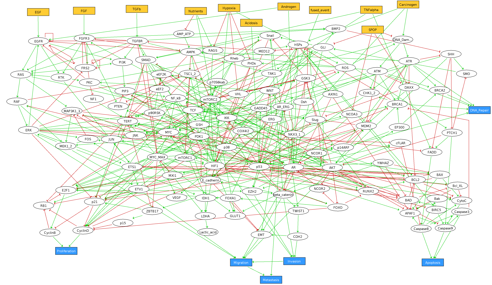

```{r setup, include=FALSE}
knitr::opts_chunk$set(echo = TRUE)
```

# Setup

Here I import the model as used in the paper and then create the data frame we will be using throughout the code.

To begin with, I used the model in its BoolNet form (.bnet), as sometimes loading from SBML form was unreliable. However using either `loadNetwork()` for a .bnet file or `loadSBML()` for an .SBML file load the same model. The model consists of a list of three sections:

-   `genes`: a character list of all genes (nodes) used in the model

-   `fixed`: a vector of all genes to flag whether a gene would be 'fixed' during the simulation

-   `interactions`: a list of all genes, each containing a list of all the gene's input nodes, their Boolean rule, and the Boolean rule in truth table format

Using this, I then created a dataset consisting of:

-   Genes: the character list of all genes

-   Values: The Boolean value of each gene (i.e. 0 or 1)

-   Rules: The Boolean rule of each gene, stored as a character of a Boolean rule

-   Degree: The number of input nodes going into each gene

I also created an individual Boolean variable for each gene, so this way when using `eval(parse(text=Rule))` , the function returned a Boolean output.

I also made sure to differentiate the input genes, 'variable genes' which would change during the time series, and output genes.

Finally whilst currently commented out, I used this chunk to store initial conditions for now, such as turning one or multiple genes either permanently off or on (i.e. setting both their variable and Boolean rule to 'TRUE'/'FALSE').

First we define a function which takes in a model of `.bnet` format and outputs a data frame we can work with

```{r}
# DEFINING FUNCTION LOADING DATA

CreateModel<-function(Model){
  
  # Creating list of genes
  Genes<-Model$genes
  
  # Counting number of genes
  num.genes<-length(Genes)
  
  # Creating data frame with Gene Name, Gene boolean value (1 or 0),
  # Gene Rule, and Gene degree
  Data<-data.frame(Genes=Genes,
                   Values=sample(c(0,1),num.genes,replace = T),
                   Rules=rep("none",num.genes),
                   Degree=rep(0,num.genes))
  
  for (i in 1:num.genes){
    # Creating a boolean variable for each gene,
    # with initial value corresponding to its inital value
    assign(Genes[i],as.logical(Data$Values[i]), envir = parent.frame())
    # Assigning each gene its rule and degree
    Data$Rules[i]<-Model$interactions[[i]][3][[1]]
    Data$Degree[i]<-length(Model$interactions[[i]][1][[1]])
  }
  
  # Returning data frame
  return(Data)
  
}
```

Now we have a data frame with all needed information, we can define the method of updating as described in Stoll et. al. (2012). I.e. checking each component to see if an update will change its value, then uniformly picking one of only these components to update at random.

```{r}
FindStableStates<-function(DataFrame,Input_Genes,num_sims,num_steps){
    
  # Number of Simulations
  N<-num_sims
  
  # Maximum number of steps per simulation
  K<-num_steps
  
  # Defining genes
  Genes<-DataFrame$Genes
  
  # Defining variable genes
  Variable_Genes<-Genes[!(Genes%in%Input_Genes)]
  
  # Size of network
  num.genes<-dim(DataFrame)[1]
  L<-num.genes-length(Input_Genes)
  
  # Checking how many steps are required for convergence
  sims<-c()
  
  # List of stable state outputs
  Stable_States<-list(rep(NA,N))
  
  for(j in 1:N){
    
      go<-TRUE
      
      #Creating random initial values of ALL genes
      DataFrame$Values<-sample(c(0,1),num.genes,replace=TRUE)
      
      for (i in 1:num.genes){
      assign(Genes[i],as.logical(DataFrame$Values[i]), envir = parent.frame())
      }
      
      # Defining time series of JUST the variable genes
      Time_Series<-DataFrame[DataFrame$Genes %in% Variable_Genes,]
    
    for (k in 1:K){
      
      sim<-1
      
      while(go){
        
            #################         1         #####################
            # Checking which components will change when updated
            # I.e. which state changes are an asynchronous transition
            
            Does.Change<-rep(FALSE,L)
            for (l in 1:L){
              
                Gen.act<-eval(parse(text=Time_Series$Rules[l]))
                # If activated and off, change induced
                if (Gen.act & Time_Series$Values[l]==0){
                  Does.Change[l]<-TRUE
              }
                # If repressed and on, change induced
                if(!Gen.act & Time_Series$Values[l]==1){
                  Does.Change[l]<-TRUE
                }
              
            }
            
            # Creating list of actual step-specific variable genes
            Step_Variable_Genes<-Variable_Genes[Does.Change]
            
            #################         2         #####################
            # Now if no genes can change, we are in a steady state and
            # end the simulation. If not, we perform an update
            
            if(length(Step_Variable_Genes)==0){
              # Log the final value of the chain as the stable state for simulation j
              Stable_States[[j]]<-c(DataFrame$Values[DataFrame$Genes %in% Input_Genes],
                                    Time_Series$Values)
              sims<-append(sims,sim)
              go<-FALSE
              
              
            }
            
            else{
              
                  ##############        3            ################
                  # Performing the actual updating scheme
              
                  # Then simply repeat the process as before
                  sim<-sim+1
                  
                  #Uniformly sample gene to update
                  Gene<-sample(Step_Variable_Genes,1)
                  
                  # For the given gene,find its rule, current value,
                  # and whether it is being activated
                  Rule<-DataFrame[DataFrame$Genes==Gene,3]
                  Gen.act<-eval(parse(text=Rule))
                  cur.val<-Time_Series$Values[Time_Series$Genes==Gene]
                  
                  # If activated and off, turn on
                  if (Gen.act & cur.val==0){
                    Time_Series$Values[Time_Series$Genes==Gene]<-1
                    assign(Gene,TRUE, envir = parent.frame())
                  
                }
                  # If repressed and on, turn off
                  else if(!Gen.act & cur.val==1){
                    Time_Series$Values[Time_Series$Genes==Gene]<-0
                    assign(Gene,FALSE, envir = parent.frame())
    
                  }
                  
                #####################################################
              
            }
        
      }
  
    }
      
  }
  
  # Calculating probabilities of each state
  Unique_States<-unique(Stable_States)
  
  Probs<-c()
  for (stable in Unique_States){
    count<-0
    for (state in Stable_States){
      if (all(state==stable)){
        count <-count +1
      }
    }
    Probs<-append(Probs,count/N)
  }
  
  # Creating list of named components instead of 1s and 0s
  Named_States<-lapply(Unique_States,
                       function(x){return(c(rev(Input_Genes),
                                            Variable_Genes)[as.logical(x)])})
  
  # Returning unique stable states and probabilities
  return(list(Unique_States,Named_States,Probs))
}
```

Now to check these results with those of a MaBoSS simulation, we need to import the results, match the stable states to each other, and then plot the corresponding probabilites.

```{r}
MaBoSS_Comparison<-function(MaBoSS_csv,Named_Stable_States,Probs){
  
  # Getting probabilities of all stable states
  MaBoSS_Probs<-MaBoSS_csv$Proba
  
  # Getting all stable states
  MaBoSS_Mat<-subset(MaBoSS_csv,select = -c(FP,Proba,State))
  n<-nrow(MaBoSS_Mat)
  maboss_states<-list(rep(NA,n))
  
  for(i in 1:n){
    maboss_states[[i]]<-colnames(MaBoSS_Mat)[as.logical(MaBoSS_Mat[i,])]
  }
  
  # Rearranging states to line up with ours
  new.order<-rep(0,n)
  for (i in 1:n){
    
    for(j in 1:n){
      
      if(all(maboss_states[[i]] %in% Named_Stable_States[[j]]) &
         length(maboss_states[[i]])==length(Named_Stable_States[[j]])){
        
        new.order[j]<-i
      }
    
    }
  
  }
  
  # Plotting our estimated probabilities versus MaBoSS' in red
  PlotData<-data.frame(State=seq(1,n),
                       Probability=c(Probs,MaBoSS_Probs[new.order]),
                       Estimate=c(rep('R Replication',n),rep('MaBoSS',n)))
  
  plot<-ggplot(PlotData,aes(x=as.factor(State),y=Probability,col=Estimate)) +
    geom_point(alpha=.9) +
    xlab("Stable State")
    theme_light()
  return(plot)
  
}
```

## Example 1: Cohen Simple Model

To begin we will attempt the simplest model given in Cohen (2015). Using GINsim, the model looks like this,


```{r}
library(BoolNet)
library(ggplot2)

# Loading the model in BoolNet (.bnet) format and converting
Cohen_Simple<-CreateModel(loadNetwork('Models/Cohen_Simple/CohenSimpleModel.bnet'))

# Then running simulations
start <- Sys.time()
Cohen_Simple_Sims<-FindStableStates(Cohen_Simple,c('ECMicroenv','DNAdamage'),1000,300)
end<-Sys.time()

print(end-start)

# Then importing MaBoSS results and seeing if ours match
Cohen_Simple_MaBoSS<-read.csv('Models/Cohen_Simple/Cohen_MaBoSS/Cohen_MaBoSS_fp.csv'
                              , sep = "\t",skip=1)
MaBoSS_Comparison(Cohen_Simple_MaBoSS,Cohen_Simple_Sims[[2]],Cohen_Simple_Sims[[3]])
```

## Example 2: Cohen Full Model 

Now we rerun the analysis, this time on the fully described version of the model in Cohen (2015). As seen here, the model uses the same input and output variables (Except for a slight name change in `CCA` to `CellCycleArrest`), but just with more in-between components. For instance, the `miRNA` component in the simple model has now become three separate components: `miR34`,`miR200`, and `miR203`.


```{r}
# Loading the model in BoolNet (.bnet) format and converting
Cohen_Full<-CreateModel(loadNetwork('Models/Cohen_Full/Cohen_Full.bnet'))

# Then running simulations
start <- Sys.time()
Cohen_Full_Sims<-FindStableStates(Cohen_Full,c('ECMicroenv','DNAdamage'),1000,300)
end <- Sys.time()

print(end-start)

# Then importing MaBoSS results and seeing if ours match
Cohen_Full_MaBoSS<-read.csv('Models/Cohen_Full/Cohen_Full_MaBoSS/Cohen_Full_MaBoSS_fp.csv',
                            sep = "\t",skip=1)
MaBoSS_Comparison(Cohen_Full_MaBoSS,Cohen_Full_Sims[[2]],Cohen_Full_Sims[[3]])
```

## Example 3: Montagud Prostate cancer model

Finally we will experiment with a much larger model published by Montagud et. al. (2022) of prostate cancer. This model now has 11 initial states instead of two as before, and is far more complex. 



```{r}
# Loading the model in BoolNet (.bnet) format and converting
Montagud<-CreateModel(loadNetwork('Models/Montagud/Montagud.bnet'))

# Then running simulations
#Montagud_Sims<-FindStableStates(Montagud,c('EGF','FGF','TGFb','Nutrients',
#                                           'Hypoxia','Acidosis','Androgen',
#                                           'fused_event','TNFalpha','SPOP',
#                                           'Carcinogen'),5,300)

# Then importing MaBoSS results and seeing if ours match
#Cohen_Full_MaBoSS<-read.csv('Models/Cohen_Full/Cohen_Full_MaBoSS/Cohen_Full_MaBoSS_fp.csv', sep = "\t",skip=1)
#MaBoSS_Comparison(Cohen_Full_MaBoSS,Cohen_Full_Sims[[2]],Cohen_Full_Sims[[3]])
```

Due to the sheer size of this model, I was not able to run any worthwhile amount of simulations using R as the computation simply took too long.

# Printing a table of stable states

Here is the code for outputting the two tables of stable states as seen in the Results section of my paper.

```{r}
# Running stable state simulation for the simple model
test<-FindStableStates(Cohen_Simple,c('ECMicroenv','DNAdamage'),1000,300)[[2]]

# Creating a data frame of a blank character variable and an indexing variable
test2<-data.frame(Stable_State=seq(1,9),Active_Components=rep('',9))

for (i in 1:9){
  
  # Checking length of stable state (i.e. number of components)
  len<-length(test[[i]])
  
  # Using 'paste' recursively to create a single charactwer variable of all
  # components, separated by ','
  output<-c(test[[i]][1])
  
  for (j in 2:len){
    
    output<-paste(output,",",test[[i]][j])
    
  }
  
  test2$Active_Components[i]<-output
  
}

# Outputting character variable which I will copy into the report
test2$Active_Components
```


```{r}
# Exactly the same code as before, except now using the full model and only 
# including input and output variables in the outputted stable state.

test<-FindStableStates(Cohen_Full,c('ECMicroenv','DNAdamage'),1000,300)[[2]]

test2<-data.frame(Stable_State=seq(1,9),Active_Components=rep('bruh',9))

for (i in 1:9){
  
  len<-length(test[[i]])
  
  output<-c(test[[i]][1])
  
  for (j in 2:len){
    
    # Only including input and output variables
    if (test[[i]][j] %in% c("EMT","Migration","Metastasis","Invasion",
                            "CellCycleArrest","Apoptosis","DNAdamage",
                            "ECMicroenv"))
    output<-paste(output,",",test[[i]][j])
    
  }
  
  print(output)
  
  test2$Active_Components[i]<-output
  
}

test2$Active_Components
```

# Effect of Mutations

To assess the affect of functions, we define a function which permanently either activates or represses as gene.

```{r}
## PERMUTATIONS

Permutation_Sim<-function(DataFrame, Mutant_Genes, On_Off){
  
  # Copying data frame
  Time_Series<-DataFrame
  
  # Finding number of genes designated as 'mutated'
  N<-length(Mutant_Genes)
  
  for (i in 1:N){
    
    # Defining mutant gene
    Gene<-Mutant_Genes[i]
    
    if (On_Off[i]==1){
      
      # If gene is assigned 1 (i.e. overexpression), we set the rule to be 
      # always TRUE, set the value to 1, and change the gene's associated
      # variable to TRUE
      
      Time_Series$Rules[Time_Series$Genes==Gene] <- TRUE
      Time_Series$Values[Time_Series$Genes==Gene] <- 1
      assign(Gene,TRUE, envir = parent.frame())
      
    }
    if (On_Off[i]==0){
      
      # If gene is assigned 0 (i.e. knockout), we set the rule to be 
      # always FALSE, set the value to 0, and change the gene's associated
      # variable to FALSE
      
      Time_Series$Rules[Time_Series$Genes==Gene] <- FALSE
      Time_Series$Values[Time_Series$Genes==Gene] <- 0
      assign(Gene,FALSE, envir = parent.frame())
      
    }
    
  }
  
  # Return edited 
 return(Time_Series)
  
}
```

Using this, we can apply the function in three different scenarios, with the outputs used in section 4

```{r}
# Applying the stable state function in combination with the permutation for
# Notch pathway overexpression

test<-FindStableStates(Permutation_Sim(Cohen_Simple,c('Notch_pthw'),c(1)),
                       c('ECMicroenv','DNAdamage'),1000,300)

# Removing the input variables from the stable states to avoid repetition
for (i in 1:8){
  
  test[[2]][[i]] <- test[[2]][[i]][!(test[[2]][[i]] %in% c('DNAdamage','ECMicroenv'))]
  
}

# Outputting unique stable states
unique(test[[2]])
```


```{r}
# Exact same computation for p53 overexpression
test<-FindStableStates(Permutation_Sim(Cohen_Simple,c('p53'),c(1)),
                       c('ECMicroenv','DNAdamage'),1000,300)

for (i in 1:4){
  
  test[[2]][[i]] <- test[[2]][[i]][!(test[[2]][[i]] %in% c('DNAdamage','ECMicroenv'))]
  
}

unique(test[[2]])
```

```{r}
# Exact same computation for TGFb pathway knockout, Notch pathway overexpression
# and p53 knockout

test<-FindStableStates(Permutation_Sim(Cohen_Simple,
                                       c('TGFb_pthw','Notch_pthw','p53'),
                                       c(0,1,0)),c('ECMicroenv','DNAdamage'),
                                        1000,300)

for (i in 1:4){
  
  test[[2]][[i]] <- test[[2]][[i]][!(test[[2]][[i]] %in% c('DNAdamage','ECMicroenv'))]
  
}

unique(test[[2]])
```

# PCA Plots

This is a simple PCA plot, using the MCA function from the package `factomineR`, which replicates the plots from Montagud (2019), except with the simplified Cohen model as opposed to the full one.

```{r}
set.seed(123)
library(mltools)
library(tidyverse)
library(data.table)
library(FactoMineR)
library(cowplot)

# Computing wild type stable states
Wild_Type <- FindStableStates(Cohen_Simple,c('ECMicroenv','DNAdamage'),1000,300)

# List of all genes
Genes<-Cohen_Simple$Genes

# List of all genes not including input genes
Variable_Genes<-Genes[!(Genes %in% c('DNAdamage','ECMicroenv'))]

# Rearranging genes to align with the output of the 'FindStableStates' function
Genes<-c('DNAdamage','ECMicroenv',Variable_Genes)

# Creating blank matrix of results
PCA_Matrix<-matrix(NA,ncol=20,nrow=9)

# Filling blank matrix with each wild type stable state
for(i in 1:9){
  
  PCA_Matrix[i,] <- Wild_Type[[1]][[i]]
  
}

# Parsing matrix into a data frame
PCA_Data<-data.frame(PCA_Matrix)
colnames(PCA_Data) <- Genes

# Removing AKT1 and WNT pathway as they have only '0' entries
PCA_Data <- PCA_Data[,!(Genes %in% c('AKT1','WNT_pthw'))]

# Turning the whole thing to factor variables to work for MCA
PCA_Data<-mutate_if(PCA_Data,is.double,as.factor)
```


```{r}
library(ggrepel)

# Estimating MCA model
mcamodel<-MCA(PCA_Data,graph=FALSE)

# Getting variable data (Automatically one-hot encoded)
Vars<-data.frame(mcamodel$var$coord,Name=row.names(mcamodel$var$coord))

# Getting only the 'Is present' rows for each variable
Pos_Vars<-Vars[seq(2,40,2),]

# Getting observations
Obs<-data.frame(mcamodel$ind$coord, State=seq(1,9))

# Removing '_1' off the end of every variable name
Pos_Vars$Name <- sapply(Pos_Vars$Name,function(x){substr(x,1,nchar(x)-2)})

# Plotting PCA 
cols<-c('blue','green','red','blue','red','green','red','black','red')

plot1<-ggplot(Obs,aes(x=Dim.1,y=Dim.2,label=Name)) +
  geom_label(aes(label=State),colour=cols) +
   geom_segment(data=Pos_Vars,aes(x=rep(0,20),y=rep(0,20),xend=Dim.1,yend=Dim.2),
                arrow = arrow(length=unit(0.2, 'cm')),alpha=.7) +
  geom_text_repel(data=Pos_Vars,aes(x=Dim.1,y=Dim.2,label=Name),alpha=.9)+
  ggtitle('PCA projection of 9 stable states and 20 state components')

plot1
```


Finally we create a pie chart of all the different states and associated phenotypes, similar again to the one provided in Montagud (2019).


```{r}
library(dplyr)

# Getting data frame of probabilities from the wild type output
data <- data.frame(value=Wild_Type[[3]],col=cols)

# Rearranging columns so the colours(phenotypes) match up
data <- data[c(3,5,7,9,2,6,1,4,8),]

# Plotting pie chart
plot3<- ggplot(data, aes(x="", y=value, fill=col)) +
  geom_bar(stat="identity", width=1, color="white",fill=cols[c(3,5,7,9,2,6,1,4,8)]) +
  coord_polar("y", start=0) +
  theme_void() +
  ggtitle('Probabilities of four phenotypes in wild type model')

plot3
```


